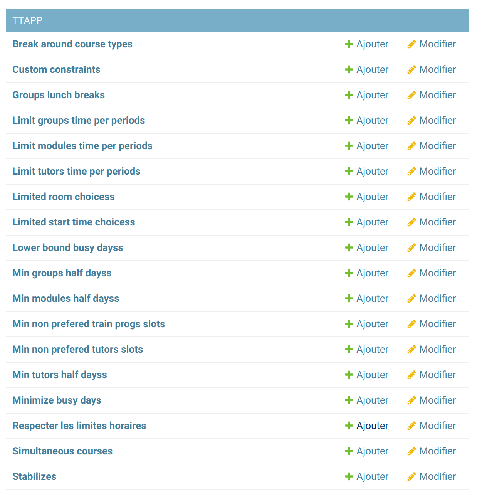
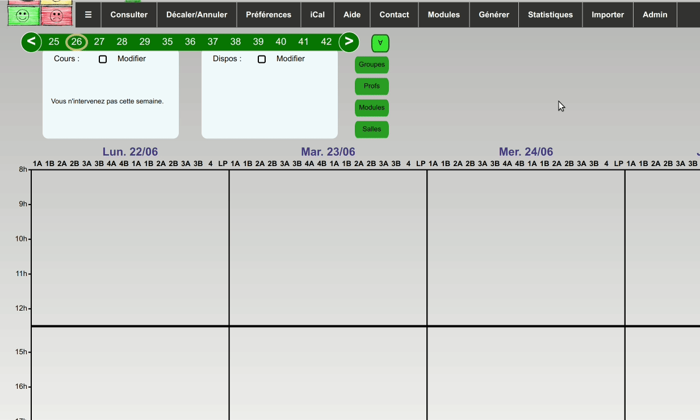

# Définir les contraintes d'emploi du temps

La définition des contraintes se fait à deux niveaux différents
1. Chaque utilisateur⋅ice doté⋅e d'un compte (enseignant⋅e, étudiant⋅e, ...) peut définir en toute autonomie 
ses indisponibilités et préférences de créneaux, ainsi que quelques autres préférences via l'interface.
2. La personne responsable de l'emploi du temps d'un département peut ajouter des contraintes/préférences
générales ou spécifiques en appliquant une des contraintes paramétrables présentes dans l'interface d'administration.

En fait il y'en aurait une troisième, qui consiste en la définition de nouvelles contraintes ad hoc, 
mais cela nécessite de mettre les mains dans le code...

## Saisie des indisponibilités et préférences par les utilisateur⋅ice⋅s

Pour l'essentiel, c'est expliqué dans cette [vidéo tuto](https://www.youtube.com/watch?v=4uxITtWVkIs&feature=youtu.be).
On fera de la doc ici bientôt.

## Ajout des contraintes via l'interface admin

Se connecter avec un user ayant des droits suffisants. Cliquer sur l'onglet admin.

Dans la rubrique `TTapp` vos trouverez les contraintes prêtes à être en base.
 En voici une description des plus fréquemment utilisées, 
avec quelques caractéristiques propres. 

- Groups lunch breaks: force une pause d'une durée définie entre telle heure et telle heure pour les groupes choisis
- Limit groups time per periods	: limite le nombre d'heures (d'un type donné) par jour/demie-journée pour
un ou plusieurs groupes.
- Limit modules time per periods : idem pour une ou plusieurs matières (éventuellement par promo) 
- Limit tutors time per periods	: idem pour un enseignant
- Limited room choices	: limite les salles possibles (pour un enseignant, un module, ...)
- Limited start time choices: limite les heures de début possible 
- Min tutors half days : minimise les demie-journées de présence/cours pour les profs choisis
- Simultaneous courses : impose qu'un ensemble de cours donnés soient simultanés

:bulb: Globalement, lorsqu'un paramètre autorise un choix multiple, n'en prendre aucun signifie les considérer tous.
Par exemple : Si vous choisissez les modules maths et français dans Limit modules time per period ça ne s'appliquera 
qu'à ces deux modules, mais si vous n'en cliquez aucun ça s'appliquera à tous!

:bulb: Les contraintes peuvent être saisies pour une semaine particulières ou pour toutes (laisser vide), 
pour une promotion particulière ou pour toutes (laisser vide), etc... 

:bulb: Attention, les contraintes ne sont valables que pour le département via lequel elles sont saisies!

Certaines sont enregistrées automatiquement à la première génération puis appliquées par défaut (il est possible
néanmoins de les désactiver):
- Min non prefered train progs slots : minimise les créneaux non préférés pour les groupes
- Min non prefered tutors slots	: minimise les créneaux non préférés pour les profs
- Minimize busy days: minimise les jours de présence des profs (en respectant leur journée idéale)
- Respecter les limites horaires: respecte la limite maximale définie par les profs
- Min groups half days: tente de libérer une/plusieurs demie-journées aux étudiant⋅e⋅s 

## Vérifier que les contraintes sont bien prises en compte
Une fois enregistrées en base, les contraintes apparaîtront lorsque le⋅a gestionnaire voudra générer un emploi du temps.
Dans l'onglet `Générer` elles apparaîtront en une phrase compréhensible, lorsqu'une semaine unique est sélectionnée (que la contrainte
concerne uniquement cette semaine, ou qu'elles les concernent toutes.)

:bulb: Dans le cas de choix de semaines multiples, les contraintes n'apparaissent pas mais sont prises en compte.