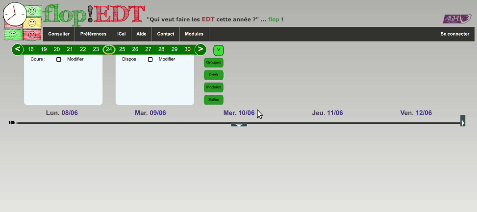
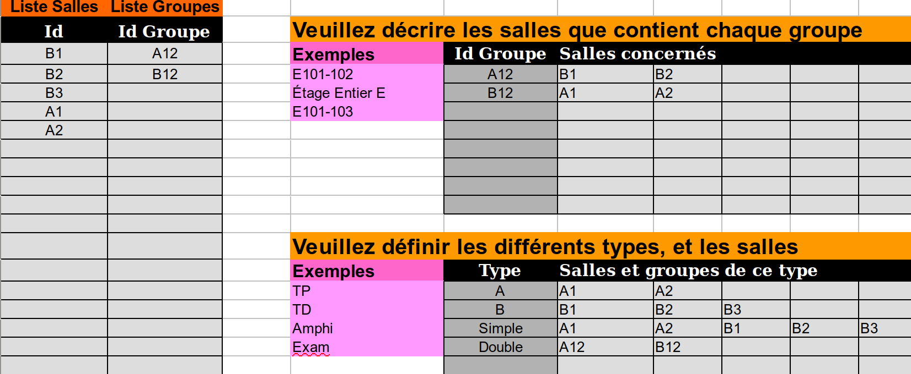

# Importer mes données dans flop!EDT

Le déploiement de la base de données se fait en trois étapes :
1. Définition des éléments de base : profs, groupes, salles, modules, ...
2. Précisions des cours : tel groupe a un cours de tel module avec tel prof dans tel type de salle...
3. Définition des contraintes : pas plus de 2h de CM par jour, minimiser les demie-journées de présence, etc...

Nous allons voir ici les deux premières étapes. 

## Première étape : définir les éléments de base

### Récupérer le fichier database_file.xlsx

Se connecter avec un superuser (par défaut: username `MOI` et mot de passe `passe`).
Aller dans l'ongler Importer et récupérer le fichier.

### Remplir le fichier
On vous invite à utiliser LibreOffice, mais **enregistrez-le en xlsx** (car on utilise le module python `openpyxl` qui a besoin de ce format.)

#### Onglet `Intervenants`
Saisissez vos enseignants, avec un `id` unique (et court si possible) en ne laissant aucune colonne vide.

:pushpin: Ne sautez pas de ligne! Les lignes après le saut seraient ignorées...

#### Onglet `Salles`
Remplir d'abord le nom des salles et des groupes de salles, puis la composition des groupes et des types de salles.

Ne pas confondre :
* un **type de salles** : *une* de ses salles seront affectées à cours qui est de ce type
* un **groupe de salles** : ayant le même statut que les salles, le groupe sera affecté à un cours, donc toutes les salles qui le composent seront affectées à un *même* cours.

Dans l'exemple, il y a 4 salles et deux groupes.
Le type `simple` affectera à un cours une des salles au choix, le type `double` affectera à un cours le groupe `B12` ou le groupe `A12`...

#### Onglet `Groupes`
C'est l'onglet le plus galère à remplir, notamment parce qu'il faut le faire de droite à gauche... :smirk_cat: 
1. Commencer par les promotions : 1ère Année, 2ème Année, etc... Des ensembles de groupes qui pourraient partager des cours, avoir des logiques propres...
2. Continuer avec les types de groupes : des groupes de TP, de TD, ... En définir un générique.
3. Définir ensuite les périodes / semestres / trimestres
4. Enfin, le plus gros : les groupes.
    * un id unique
    * la promo auquel il appartient
    * son surgroupe direct (structure d'arbre)
    * son type de groupes

:pushpin: Au risque de me répéter... il ne pas sauter de ligne ni en insérer/supprimer, préférer le couper/coller.

#### Onglet `Modules`

Saisissez vos modules, là encore avec un `id` unique (et court si possible) en ne laissant aucune colonne vide (quitte à mettre des infos non-utiles).
:pushpin: Comme d'hab, ne sautez pas de ligne! 

#### Onglet `Cours`
On n'en est pas encore à dire combien de cours aura à faire chaque enseignant⋅e / groupe, simplement à définir les types existants. 
Les types de cours ont:
- une durée (en minutes)
- des types de groupes correspondants
- des heures de début possibles

Cela permettra d'attribuer aux cours d'un type donné des caractéristiques propres (par exemple les examens ne pourront être que le samedi, les TP sont plutôt le matin, pas plus de 2h de CM par jour, etc.)

Et enfin...
#### Onglet `Paramètres`
Décrire les horaires et les jours d'activité devotre département, ainsi que la taille des créneaux de définition des disponibilités (en minutes).

:bulb: S'il n'y a pas de pause méridionale, choisissez une heure de début de fin identique (par exemple 13 h).

### Déployer le fichier rempli pour définir votre département

Il y aura probablement des erreurs... à corriger!

## Deuxième étape : définir les cours à placer
### Récupérer le fichier planif_file.xlsx correspondant à votre département
Il a été fait sur mesure pour vos besoins !

### Remplir les onglets pour chaque département
***flop!EDT*** a été pensé pour des structures où les cours à placer changeaient complètement chaque semaine. Il y a donc un gros travail pour remplir ce tableur. Mais une fois que c'est fait, vous aurez passé le plus gros.

:pushpin: Evidemment, si votre planification de cours ne change pas d'une semaine sur l'autre, vous pouvez ne remplir qu'une semaine...
