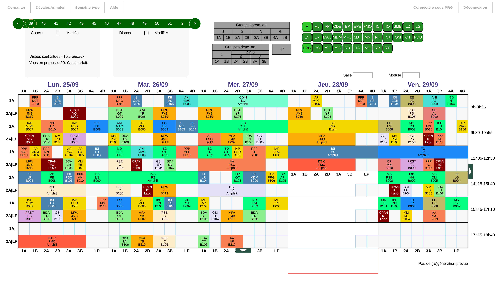
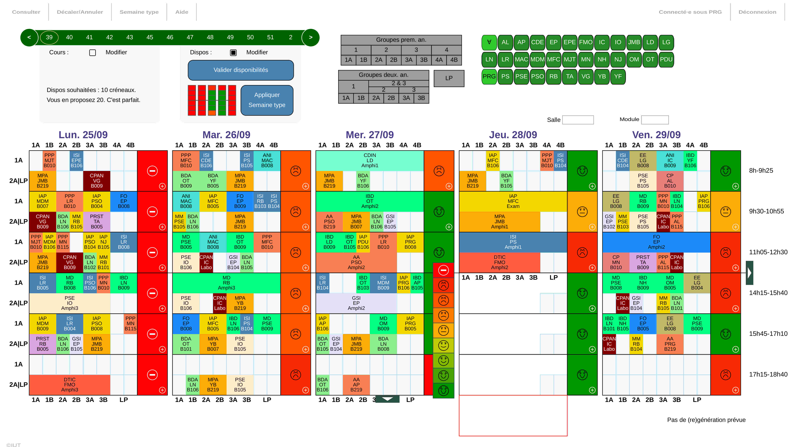

FlOpEDT/FlOpScheduler est un outil de gestion
d'emplois du temps comprenant :
- une application web permettant aux utilisateurs
  * d'exprimer leurs contraintes et préférences
  * de modifier l'emploi du temps
- un moteur de génération d'emplois du temps qui respectent les contraintes et
maximisent la satisfaction générale.

## Licence

[AGPL v3](https://www.gnu.org/licenses/agpl-3.0.html)

## Principales dépendances
- [Django](https://www.djangoproject.com/) pour le site
- [PostgreSQL](https://www.postgresql.org/) pour la base de données
- [PuLP](https://github.com/coin-or/pulp) pour la modélisation en ILP (Integer Linear Programming)
- Un solveur de ILP, e.g. [CBC](https://projects.coin-or.org/Cbc), [Gurobi](gurobi.com)
- [Redis](https://redis.io) pour le cache de Django (optionnel)

## Lancement dans un container Docker

Après l'installation de `docker` et `docker-compose` :

Lancer la commande suivante pour récupérer les images de base et instancier les containers. Cette commande n'est à exécuter qu'une seule fois et peut prendre un peu de temps.

`docker-compose build` 

Ensuite, vous pourrez lancer le serveur à l'aide de la commande:

`docker-compose up` (Ctrl+C pour arrêter l'application)

L'application sera accessible à l'adresse http://localhost:8000.

Vous pouvez importer le fichier dump.json (qui est une base pour jouer avec l'interface) avec la commande :

`docker-compose run --rm web ./FlOpEDT/manage.py loaddata dump.json --settings=FlOpEDT.settings.development`

Vous pourrez alors vous connecter avec l'utilisateur 'MOI' et le mot de passe 'passe'. (En fait, tous les utilisateurs ont le même mot de passe !)

Les paramètres de la configuration courante se trouvent dans `FlOpEDT/settings`. Par défaut, on utilise la configuration `development`. On peut spécifier une autre configuration en modifiant la variable d'environnement `EDT_CONFIG` comme suit :

`export EDT_CONFIG=production && docker-compose up`

## Contributions
- [Discuter](https://flopedt.slack.com)
- [Soulever une issue](https://framagit.org/FlOpEDT/FlOpEDT/issues)

